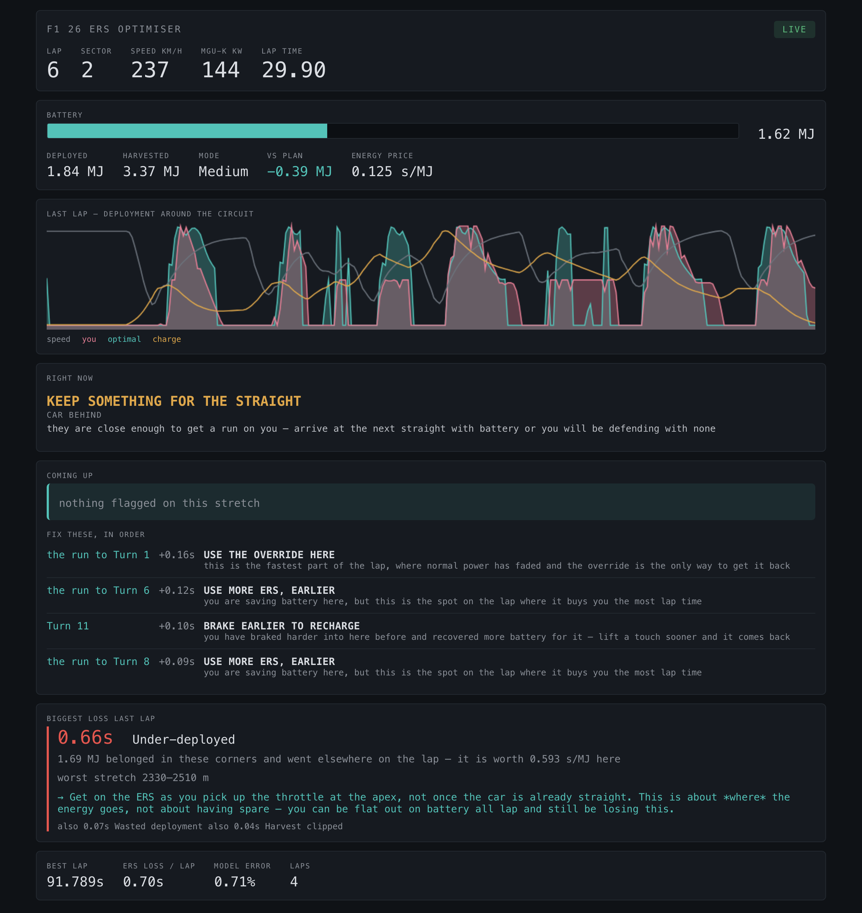
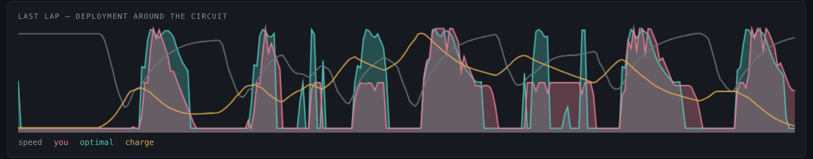
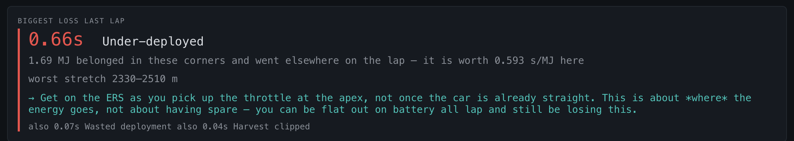
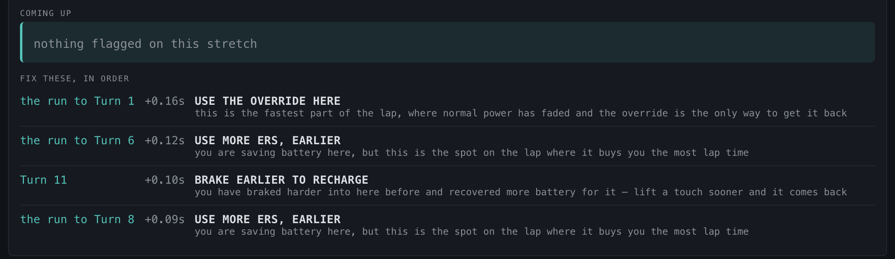

# F1 26 ERS Race Optimiser

Live energy-deployment coaching for **EA F1 25: 2026 Season Pack**. It listens to
the game's UDP telemetry at 60 Hz, fits a physics model of your car from your own
laps, works out where the battery should have gone, and after every lap tells you
the biggest thing ERS cost you, in seconds.



*Live during lap 6 of a Bahrain race. Real telemetry, replayed.*

## Running it

Python 3.10+ and numpy. Nothing else.

```bash
python3 -m f126ers.app --web          # browser dashboard (recording on)
python3 -m f126ers.app                # terminal dashboard (recording on)
python3 -m f126ers.app --index        # what is in the session I just drove?
python3 -m f126ers.app --replay       # re-analyse it in full
python3 -m f126ers.app --quali        # one-lap mode, finishes the lap empty
python3 -m f126ers.app --baseline 5   # 5 uncoached laps first, then coach
```

In game: Settings → Telemetry → **UDP On, Format 2026, Port 20777, Rate 60 Hz,
Your Telemetry: Public**. The last two settings matter. At 20 Hz the dynamics fit
loses half its resolution, and anything other than Public strips the other cars
out of the packets, which kills the tow and gap measurements.

You can try it without the game at all:

```bash
python3 make_fake_session.py session.f1 && python3 -m f126ers.app --replay session.f1
```

## What it shows you

Deployment around the lap: your speed trace, where you put the energy, and where
the optimiser would have put the same energy.



The verdict at the end of each lap, priced in seconds and pointed at a specific
stretch of track.



A ranked list of fixes, each with the time it is worth and the reason it is worth
it, so you can pick one to work on rather than being told six things at once.



The terminal dashboard shows the same thing over SSH or on a second monitor:

```
F1 26 ERS OPTIMISER   lap 6   sector 2
──────────────────────────────────────────────────────────────────────────────
  SOC ██████████░░░░░░░░░░░░░░  1.62 MJ   deployed 1.84  harvested 3.37
  237.0 km/h   gear 6   MGU-K 144.0 kW   lap  29.90s

  vs plan -0.39 MJ   energy price 0.125 s/MJ

  ◆ car behind:  KEEP SOMETHING FOR THE STRAIGHT
    they are close enough to get a run on you — arrive at the next straight
    with battery or you will be defending with none
──────────────────────────────────────────────────────────────────────────────
LAP 5  93.505s   optimal ERS would give 0.73s   model error 0.7%
  speed  █████████▇▄  ▁▃▄▅▆▆▆▇▇▆▂ ▁▃▄▅▄▃▃▃▄▁ ▁▃▄▅▄▂  ▃▄▅▆▇▇▇▇▅▂▂▃▄▅▅▅▅▅▅▂▁▃▄▅
  you                  ▄▇▅▃▁       ▃▆▄   ▃   ▂▃▃▃    ▆▇▇▆▅▃▃▁   ▃▃▃▃▃▃▃   ▄▇▆
  optimal▃            ▂▇▇▇▆▄      ▃▇▇  ▁     ▃▇▇▅    ▅▇▇▅▄▃    ▁▄▇   ▂    ▅▇▇
  charge            ▁▃▃▃▂▁▁▁▁▁▁▁▂▃▃▃▂▂▂▃▃▃▃▄▅▅▅▅▄▅▅▇▇▇▆▆▅▅▄▄▄▄▅▆▅▅▅▄▄▄▃▄▄▅▅▄

  BIGGEST LOSS 0.66s  Under-deployed
  1.69 MJ belonged in these corners and went elsewhere on the lap
  worst stretch 2330–2510 m
  → Get on the ERS as you pick up the throttle at the apex, not once the car
    is already straight.
```

## Recording

Recording is always on. Every run writes two files into `sessions/`: a `.f1` with
every UDP packet exactly as it arrived, so a replay is byte-identical, and a
`.log` with one plain-text line per lap.

Nothing has to be noted by hand. Pit stops, laps spent within a second of another
car, low-deployment laps, override use, assists and safety-car periods are all
worked out from the packets. `--index` reports what a recording contains and
which of the model's fits it can feed:

```
RECORDING  2026-08-07-185828.f1
  554.3 MB, 548,178 packets, 22.0 minutes of session time
  59 frames per second
  race, 14 laps scheduled, 5408 m lap
  assists: traction control off, ABS off

LAPS
  lap    time   deploy  harvest   ahead  behind   flags
    1 100.155  10.12MJ   7.51MJ    87%    91%   safety car, 5x override
    2  91.789   9.05MJ   8.45MJ    19%    98%   6x override
    ...
    8 113.980   9.59MJ   9.00MJ     0%    81%   PIT STOP, 5x override
  11 of 14 laps usable (the rest are pit, safety car or invalidated)

WHAT THIS RECORDING CAN CALIBRATE
  [yes] pit stop                 lap 8
         prices a lap spent in the pit lane (PIT_VALUE, currently an estimate)
  [yes] low-deployment laps      lap 3, 10
         separates drag from motor power (20% spread, 15% needed)
  [ no] clean air                none found
         the baseline every other lap is measured against

MISSING — worth two minutes next session
  - clean air: the baseline every other lap is measured against
```

## Why a race needs different maths

Almost every ERS guide is written for a qualifying lap: start full, finish empty,
deploy on the exits. A race lap is a harder problem.

The lap has to be repeatable. Energy you spend now and don't harvest back is
energy you won't have next lap, so a quick lap that leaves you empty is a loan and
should be priced like one.

Harvest isn't a constant either. In clean air you brake later and recover less, so
the energy budget moves lap to lap and the right deployment moves with it. And
spending sector 1's energy leaves sector 3 dry; where the shortfall bites depends
on the circuit, not on a rule of thumb.

## How it works

### 1. Fitting the car

The longitudinal model, per unit mass, over distance `s`:

```
d(v²/2)/ds  =  a·P(s)/v  −  drag(s)·v²  −  c
drag(s)     =  b + db·aero(s)
```

Power is measured, not inferred: the 2026 packet format reports `EnginePowerICE`
and `EnginePowerMGUK` in watts. The unknowns `(a, b, db, c)` come out of a least
squares fit, with three details that decide whether it works:

- **Integral form.** The game reports speed as a whole number of km/h.
  Differencing that over a 10 m bin gives an acceleration estimate noisier than
  the signal itself, so the equation is integrated over roughly 100 m first. Still
  linear in the unknowns, no longer swamped by quantisation.
- **Pooled across laps.** A single lap has a single deployment pattern, which
  leaves power and drag nearly collinear: the fit reproduces that lap and
  mispredicts every other one. Since the whole job is predicting laps you haven't
  driven, rows are pooled across laps, where the different deployment patterns
  supply the excitation that makes the parameters identifiable.
- **Ridge toward the previous estimate**, in normalised column units, which makes
  it a recursive estimator. It tracks a car whose fuel load and tyres are changing
  without lurching on one noisy lap.

`db` picks up the 2026 active-aero drag difference between corner and
straight-line mode, which is far too large to average over.

### 2. Power limited or grip limited?

For each distance bin the model compares the acceleration achieved against what
the delivered power should have produced. Where the car fell well short at full
throttle, grip was the binding constraint, not power.

This is what makes corner-exit advice honest. A car on exit is traction limited,
already using every newton the tyres will give, and extra deployment there buys
nothing. Treating "full throttle" as "power limited" would have the optimiser
promise exit time the tyres cannot deliver.

### 3. The optimiser

```
minimise    T = Σ ds / v
over        u(s) ∈ [0, P_max(v)]
subject to  dE/ds = −u/v + h(s),   0 ≤ E ≤ E_cap,   E(L) ≥ E_target
```

Solved by Pontryagin / Lagrangian relaxation rather than a 2-D dynamic program
over (distance, charge). Relaxing the energy budget with a multiplier λ makes the
problem separable into a 1-D dynamic program over speed alone:

```
min_u  Σ [ dt + λ·u·dt ]
```

Bisect λ until the solution spends exactly the available budget and you have the
constrained optimum, plus λ itself as a first-class object rather than a finite
difference of a value surface.

λ is the shadow price of energy, in seconds per joule, and it is the centre of the
whole tool. The optimal policy is bang-bang in the local time-gain-per-joule
`g(s)`: deploy where `g(s) > λ`, don't where it isn't. Corner exits beating the end
of a straight is not a rule the tool was taught. It falls out, because `g` is large
at low speed and collapses to zero above the MGU-K taper knee.

When charge hits a bound mid-lap λ stops being constant and jumps at the contact
point, so the lap is split there and each segment solved with its own λ. That is
the standard state-constrained construction, and it is what makes "empty through
sector 3" a case with an answer rather than an error.

`E_target = E_start` by default, so the plan is repeatable every lap of a stint.
Qualifying mode is the same solver with `E_target = 0`.

### 4. Attribution

Three quantities, deliberately kept apart:

| | measured by |
|---|---|
| Allocation loss (this lap) | simulated actual lap − optimal lap *on the energy you actually spent* |
| Harvest loss (this lap) | re-solving on the energy your own best braking recovers in those zones |
| Sustainability cost (next lap) | λ × the charge deficit carried over |

Both laps go through the same simulator with the same speed envelope, so line and
braking cancel out and what is left is ERS.

Comparing against the same energy you spent is what separates "you put it in the
wrong place" from "you spent more than the lap can afford". Mix them and they
cancel, and a battery-dump lap looks fine. Within the allocation loss, λ and `g(s)`
rank the symptoms and the measured total is shared out across them: the ranking
comes from the economics, the total comes from the simulator. Pricing a whole
block of energy at λ would overstate it, since λ is by definition the value of the
last joule.

Symptoms it detects: wasted deployment, battery depleted, under-deployed, missed
harvest, override misused, unsustainable.

## Results

`python3 test_optimiser.py` runs a toy circuit with a known answer:

- the optimiser deploys 162 kW on corner exits and 0 kW at high speed, derived
  rather than told
- lap time is monotone in the energy budget, and λ falls as energy loosens
- charge bounds and the per-lap budget hold, and qualifying mode beats neutral
- a battery-dump lap costs +0.95 s against the optimal use of the same energy
- feeding the optimum back in raises no issues, so no false alarms

End to end on a synthetic session where the truth is known:

| metric | result |
|---|---|
| model fidelity (simulated vs actual lap time) | 0.13 % |
| parameter recovery (`a`, `b` vs truth) | within 1.5 % |

Fidelity is the number that matters, because it is measured on laps driven with a
deployment pattern the model was never fitted to.

On a real 14-lap Bahrain race, 554 MB and 548,178 packets at 59 Hz:

| metric | result |
|---|---|
| model fidelity on a real car | 2.4 % |
| laps analysed | 13 of 14 |
| pit stop, following laps, override use | all detected without being told |

Real data found five bugs the synthetic fixture could not produce. The worst was
silent: `sessionType` is 15 in the 2026 format, not 10, so every race-only feature
(the across-laps plan, the race tips, the overtake economics) had been switching
itself off in exactly the situation it was written for.

## Layout

| file | |
|---|---|
| `telemetry.py` | UDP parsing (2026 layout), record/replay |
| `track.py` | distance binning, system identification, speed envelope, taper, harvest map |
| `optimiser.py` | forward simulator, co-state DP, λ, marginal time-gain |
| `analysis.py` | attribution, issue detectors, verdict, in-lap cues, session metrics |
| `stint.py` | energy curve, across-laps DP, pit-lap weighting |
| `traffic.py` | following deficit, attack economics, break-even probability |
| `places.py`, `situations.py` | where on track a tip applies, and race-context advice |
| `index.py` | what a recording contains, derived from the packets |
| `dashboard.py`, `web.py` | terminal and browser UIs |
| `app.py` | live / replay / index / baseline modes |

Self-checks live next to the code they check: `python3 f126ers/telemetry.py`
verifies the packet layouts, `python3 f126ers/track.py` checks parameter recovery.

## Limits

- Whether an overtake sticks is not derivable from your telemetry, so it is
  inverted into a break-even probability instead of guessed at.
- `PIT_VALUE`, the worth of energy on a lap partly spent in the pit lane, is still
  an estimate. It becomes measurable from the first recording with a stop in it.
- Point-mass longitudinal model: no fuel burn, and no corner-by-corner grip
  evolution beyond what the envelope and the tyre-age fit pick up.
- 2026 packet format only. Older formats are rejected with a message rather than
  silently misparsed.
